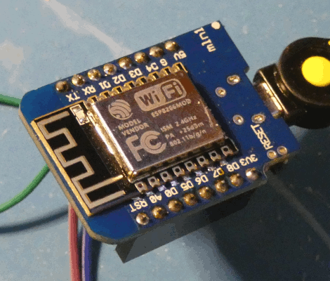
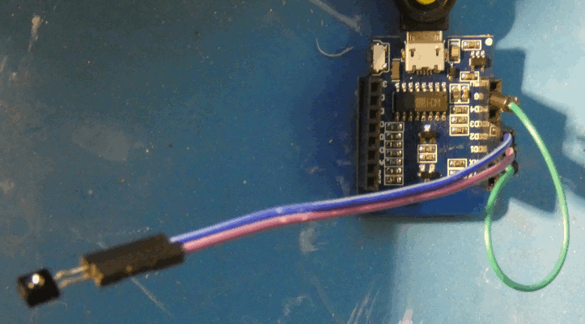
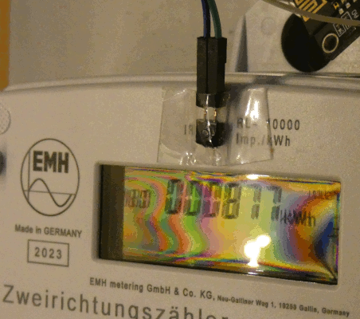

# Smartmeter

## WLAN-Modul um die IR-Pulse eines Smartmeters aufzuzeichnen
Viele Smartmeter haben eine IR-Schnittstelle, über die je Abrechnungseinheit ein IR-Impuls ausgestrahlt wird. Wenn man die Pulse pro Minute mitzählt, erhält man ein direktes Maß für den Stromverbrauch in dieser Zeit.


* Ein `D1-mini` mit einem `ESP8266` reicht für diesen Zweck völlig aus. Der Stromverbrauch dafür liegt bei ca. 60mA@5V (0.3 Watt) für nodeMCU.
* Man braucht noch einen `IR-Transistor` als Empfänger und ein kurzes Kabel von `D2` und `D3` das bis zum Smartmeter reicht.



* Ein USB-Netztei und ein kurzes USB-Kabel bis zum D1-mini/NodeMCU und zusätzlich eine Drahtbrücke(grün) oder einen 1kOhm Widerstand für `D1`

Der ESP8266 hat genug Speicher für minütliche Daten von 1-2 Monaten (je nach Verbrauch). Damit müssen die Daten nicht täglich abgerufen werden. Der Abruf kann bequem über WLAN im lokalen Netz durchgeführt werden. Dazu muss jedoch `SSID` und `Passwort` eingetragen werden.

**Keine Cloud**. Die Daten verlassen das lokale Netzwerk nicht. Es werden keinerlei personenbezogenen Daten gespeichert.

#### Kalkulation:

    * 2.50 € wemos D1-mini ESP-8266 (NICHT ESP-32 !!!) mit Buchsenleiste und micro-USB
    * 0.10 € Fototransistor (Receiver hat nur 2 Pins, weil die Basis IR-Licht empfängt)
    * 0.10 € 1kOhm Widerstand oder kurze Drahtbrücke
    * 2.05 € USB-Netzteil 5V mit Kabel für micro-USB (oder von altem Telefon)
    * 0.25 € 10cm 2-poliges Kabel abgespaltet von einem 40pin Flachkabel (male to female)
    * `5.00 €` 

## Was notwendig ist, um das Projekt auf einem ESP-8266 zu installieren:
Verwendet wird in diesem Fall Lua.

### Weitergehende Infos
 * https://nodemcu.readthedocs.io/en/release/
 * https://nodemcu.readthedocs.io/en/release/getting-started
 * https://github.com/andreaskielkopf/SmartmeterGui

## Hardware
Mögliche Hardware: D1-mini, NodeMCU, ...(mit ESP-8266)

### IR-Empfang
Um die IR-Signale zu erfassen wird ein IR-Receiver benötigt. Dazu reicht ein einfacher Fototransistor.(Z.B. `SFH3100F`) Der hat 2 pins !!! und wird an die Anschlüsse `D2` und `D3` angeschlossen .Die Pins für den IR-Transistor können in `blinker.lua` geändert werden.
(Im weiteren Verlauf wird dann noch ein 1kOhm Widerstand von Masse(G) zu D1 gebraucht.) 

## Grundfirmware mit esptool flashen
NodeMcu oder D1-mini per USB- an den PC anschließen. Achtung das muss ein USB-Kabel sein, das auch Datenleitungen enthält. Manche reinen Ladekabel eignen sich nicht. Die vorbereitete Firmware liegt im Ordner /bin. Du kannst sie aber auch selbst compilieren

### Verbindung testen:
```
esptool -v -c esp8266 -p /dev/ttyUSB0 read-mac 
```
Wenn das geht, ist das Kabel OK.

### Firmware installieren:
Die Dateien [0x00000.bin](https://github.com/andreaskielkopf/smartmeter/raw/master/bin/0x00000.bin) und [0x10000.bin](https://github.com/andreaskielkopf/smartmeter/raw/master/bin/0x10000.bin) enthalten die von mir vorbereitete Firmware.

```
esptool -v -c esp8266 -p /dev/ttyUSB0 erase-flash
esptool -v -c esp8266 -p /dev/ttyUSB0 write-flash -fm dout 0x0 0x00000.bin 0x10000 0x10000.bin 
```

## Software
Die Software enthält:
* `smartmeter`
  Das eigentliche Programm zum Erfassen der IR-Impulse
* `telnet` auf port 2323
  Zum fernsteuern z.B. mit `putty` oder einem anderen telnet-Client (momentan deaktiviert)
* `ftp-server` (Zugang mit user=smart und passwort=meter)
  Zum direkten Zugang zu den Dateien (Lua-Programme und Messwerte) z.B. mit `mc` oder einem anderen ftp-Client
* `http-server` 
  Um die Messdaten programmatisch abfragen zu können z.B. mit `curl` oder [SmartmeterGui](https://github.com/andreaskielkopf/SmartmeterGui)

Damit das alles nicht zu viel RAM(`Heap`) braucht, muss der Großteil davon im LFS gespeichert sein. 
Nur die Startdatei `init.lua` muss unbedingt im normalen Dateisystem(`SPIFFS`) liegen bleiben

### Software aufspielen
 * https://nodemcu.readthedocs.io/en/release/upload/

#### [eus_params.lua](https://github.com/andreaskielkopf/smartmeter/raw/master/src/eus_params.lu_)
Es gibt verschieden Wege den ESP-8266 an ihr WLAN anzupassen. Aber irgendwie muss er ja SSID und Passwort bekommen. Sonst ist er später nicht im WLAN erreichbar.

Eine Möglichkeit ist es die Datei `eus_params.lua` an ihr WLAN anzupassen.
* SSID eintragen
* Passwort eintragen
* Datei umbenennen von `eus_params.lu_` nach `eus_params.lua`

#### [init.lua](https://github.com/andreaskielkopf/smartmeter/raw/master/src/init.lua)
Das ist die Startdatei die nach dem Einstecken der Betriebsspannung gestartet wird. Diese muss im `SPIFFS` installiert bleiben. 
Sie prüft, ob die Verbindung bei D1 besteht.
* mit D1 auf Masse, startet der Smartmeter (durch `start.lua`)
* mit D1 offen hält der Boot an (Um mit dem ESPlorer Dateien aufspielen zu können)
* Der Pin D1 kann in `init.lua` geändert werden

#### [smartmeter.img](https://github.com/andreaskielkopf/smartmeter/raw/master/src/smartmeter.img)
Alle LUA-Quelltexte für das Projekt sind bereits in die Datei `smartmeter.img` compiliert. Diese Datei muß unbedingt im `LFS` installiert werden.

Zwar können einzelne Dateien auch im `SPIFFS` auf dem ESP-8266 gespeichert werden, und diese haben dann Vorrang, aber das braucht eine Menge RAM(Heap) zur Laufzeit. Der FTP-server zum Beispiel funktioniert deswegen nur aus dem `LFS`.

#### [start.lua](https://github.com/andreaskielkopf/smartmeter/raw/master/src/start.lua)
Das ist das eigentliche Programm. Es wird nur dann gestartet, wenn `init.lua` die Brücke bei D1 findet. (`start.lua` und `init.lua` sind auch im LFS enthalten, aber `init.lua` kann nicht von dort starten)

#### mit ESPlorer uploaden
Alle diese Dateien ([`smartmeter.img`](https://github.com/andreaskielkopf/smartmeter/raw/master/src/smartmeter.img), `eus_params.lua`, [`start.lua`](https://github.com/andreaskielkopf/smartmeter/raw/master/src/start.lua) und zuletzt [`init.lua`](https://github.com/andreaskielkopf/smartmeter/raw/master/src/init.lua) müssen per [Upload] ins Dateisystem(`SPIFFS`) auf den ESP8266 übertragen werden.
(Bitte dazu erst mal die Brücke an D1 entfernen)

* Ports refreshen
```
ESPlorer -> [rechte Bildschirmhälfte] -> [Knopf mit blauem Kreis]
```
* Port für die Verbindung wählen (meist /dev/ttyUSB0 oder ähnlich)
```
ESPlorer -> [rechte Bildschirmhälfte] -> [Dropdown]
```
* Verbinden (mit 115200 Baud)
```
ESPlorer -> [rechte Bildschirmhälfte] -> [Großer Knopf "Open"]
```
* Reset des 8266 (per RTS)
```
ESPlorer -> [rechte Bildschirmhälfte] -> [Knopf RTS]
```
  `[RTS]` einschalten, kurz warten, ausschalten.
  Spätestens jetzt sollten die ESP-Startmeldungen im Fenster erscheinen.

* Upload erste Datei ins `SPIFFS`
```
ESPlorer -> [linke Bildschirmhälfte] -> [NodeMCU & MicroPython] -> [Scripts] -> [Upload ...] "smartmeter.img"
```

* Nun das selbe mit den anderen Dateien ... 

* Dann überprüfen, ob es geklappt hat mit:
```
ESPlorer -> [rechte Bildschirmhälfte] -> [FS Info] -> [Reload] 
```
Danach sollten alle erfolgreich ins `SPIFFS` upgeloadeten Dateien aufgelistet werden

#### LFS installieren
Um `smartmeter.img` als `LFS` zu installieren muss im ESPlorer Terminal noch der Befehl `node.flashreload('smartmeter.img')` ausgeführt werden
```
ESPlorer -> [rechte Bildschirmhälfte] -> [untere Hälfte] -> [helles Eingabefeldt]
```
Den Inhalt des Eingabefelds durch 
```
node.LFS.reload('smartmeter.img')
```
 ersetzen, und `[return]` drücken.
Danach sollte der ESP-8266 einige Zeilen ausgeben, und dann automatisch neu starten.

https://nodemcu.readthedocs.io/en/release/modules/node/#nodelfsreload

### Autostart
Nachdem die Hardware eingerichtet und die Software aufgespielt ist, kann das Projekt in Betrieb genommen werden.
Damit die Software automatisch startet ist eine Drahtbrücke oder besser ein `1kOhm Widerstand` zwischen Masse(`G`) und `D1` notwendig.
Wenn ein Fehler bei der Entwicklung passiert, kann durch entfernen der Brücke zu `D1` der Autostart (Bootschleife) unterbrochen werden

## Tests
Jetzt am D1-Mini die Resettaste kurz drücken um das Programm zu starten.
Es kann sein, dass beim Allerersten Boot die Verbindung zum WLAN nicht innerhalb 30 Sekunden klappt. Einfach nochmal 30 Sekunden warten, und dann nochmal Reset drücken. (Später gehts dann innerhalb von 2-3 Sekunden)

### HTTP server
Beim starten des ESP-8266 an ESPlorer, zeigt er die IP an, die er bekommen hat. Es ist gut sich diese zu notieren ;-)

Bei mir war das `192.168.178.45`

#### Abfrage des Heap
Z.B mit linux `curl`:
`curl http://192.168.178.45/smartmeter/heap`
ergibt z.B.
```
{"Heap":30280}
```
oder mit einem Browser:
`http://192.168.178.45/smartmeter/heap`
ergibt:
```
{"Heap":34056}
```
Der freie Heap sollte ca. 30kByte groß sein


#### Abfrage der Musterdaten aus `2025-12-01.lua` im `LFS`
`curl http://192.168.178.45/smartmeter/data/2025`
ergibt
```
{"Data":
{"filter":"2025", "found":[12]}
}
```

### IR-Empfang
**Achtung !** Der IR-Empfang ist in den ersten ca. 60 Sekunden **ausgeschaltet**. Danach blinkt die blaue LED genau 1x. Dann ist der IR-empfang scharfgeschaltet.

Jeder Impuls des Smartmeters, der vom IR-Transistor empfangen wird, wird durch Aufblinken der blauen LED an D4 quittiert. Das kann man leicht mit einer beliebigen IR-Fernbedienung prüfen. 

#### Wenn das nicht oder schlecht klappt:
* Wackelkontakt der Leitung zum IR-Empfänger -> nachprüfen
* IR-Empfänger an D2,D3 verpolt angeschlossen -> IR-Empfänger umstecken
* Mit der Fernbedienung auf die Rückseite des Sensors gezielt (Der Empfang geht vorne wo die Linse ist deutlich besser)
* Umgebungslicht zu hell -> etwas abdunkeln
Der Empfang sollte zumindest bis zu ca. 5cm entfernt von der Fernbedienung funktionieren.

### Abfrage der aktuell gemessenen Daten
`curl http://192.168.178.45/smartmeter/data`
ergibt z.B.
```
{"Data":
{"hour":8, "ticks":[106,107,116,118,118,16]}
}
```
oder
```
{"Data":
{"hour":18, "ticks":[0,0,0,0,0,0,0,0,0,0,0,0,0,0,0,0,0,0,0,0,0,0,0,0,0,52]}
}
```
Das sind die gezählten Impulse der IR-Fernbedienung

# Installieren
Das Smartmeter im Zählerschrank hat oben in der Mitte eine kleine durchsichtige LED


Über die kann der IR-Empfänger mit einem Klebeband geklebt werden. 
Links davon steht `IR`. Rechts davon steht bei mir dran, dass `10.000 IR-Pulse pro kWh` gesendet werden. 
Sobald das Modul eingesteckt ist, sollte nach 60 Sekunden die blaue LED zu blinken beginnen.

# ToDo´s

* Eine elegante [Update-Funktion der Software](https://github.com/andreaskielkopf/Smartmeter/blob/master/tips.md) über lokales FTP
* Die Abfrage eines Tages liefer keine Daten, wenn die erste Stunde fehlt
* Liste der vorhandene Dateien mit Messwerten
* Löschen alter Dateien bei Platzmangel (ca. 100kByte im SPIFS frei halten)
* Zusätzliches Projekt um die Daten auszulesen und in einer GUI darzustellen [SmartmeterGui](https://github.com/andreaskielkopf/SmartmeterGui)

* Erweiterung auf Temperaturmessung und Feuchtemessung (wenn die entsprechenden Module angeschlossen sind)
* Deaktivierung des IR-Empfangs, wenn keine Impulse kommen (einfrieren der Daten)